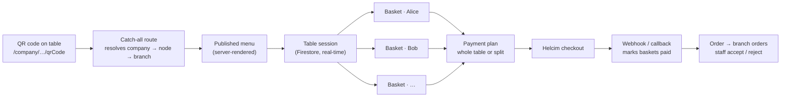
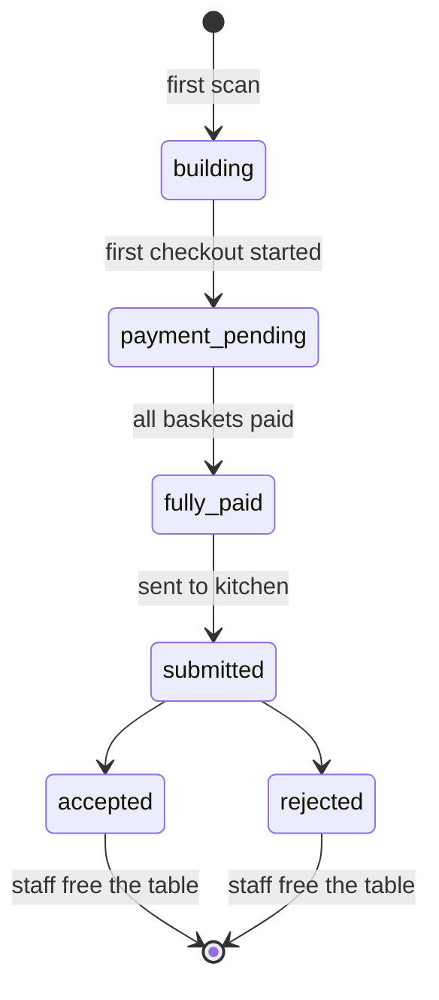

<div align="center">

# Qraving

*QR + craving: scan your craving.*

**A shared-cart, QR-code ordering web app for restaurants, cafés, hotels, events, and anywhere people order together.**
Scan the code on the table, browse the menu, and everyone at the table adds to one live cart. No app to install, no account to create, and no waiting for someone to bring a menu.


[](LICENSE)
[](https://github.com/tarekFerdous/Qraving/actions/workflows/ci.yml)

<!-- SCREENSHOTS: hero image goes here, e.g.

-->

</div>

---

## Features

- **One QR per table.** Every code points at one company, branch and table, so orders are routed with no input from staff.
- **Shared cart with auto-join.** The first scan opens a table session. Every later scan of the same code joins it, with no join code or invite link.
- **Per-person baskets.** Each diner gives a name and phone number (email optional). Items stay grouped by person, with no login.
- **Live sync.** Every device sees cart changes as they happen, through Firestore real-time listeners.
- **Dietary transparency.** Vegan, vegetarian, halal, kosher, gluten-free, lactose-free and nut-free icons, plus allergen warnings (peanuts, shellfish, dairy, gluten, eggs, soy, tree nuts).
- **Customizations.** Sizes, add-ons and free-text instructions ("no onions"). Matching items merge into one line with a higher quantity.
- **Flexible payment.** One person can pay for the whole table, or each person pays their own basket. Shared items (a bottle, a dessert) can be split across chosen people.
- **Payment before the kitchen.** An order goes to the kitchen only once the table has paid, through Helcim (card, Apple Pay, Google Pay, Interac).
- **SMS receipts** through Twilio.
- **Any business shape.** Each company defines its own layers (for example *Branch → Floor → Table*, or *Hotel → Wing → Room*), and managers can be assigned at any layer.
- **Two admin panels.** A super-admin panel to onboard companies, and a per-company manager panel to run menus, tables, QR codes and live sessions.
- **Live menu safety.** If a manager deletes an item mid-session, it is removed from every open cart and the diners are told.

## How it works



1. **Resolve.** A scan opens `/{companySlug}/…/{qrCode}`. The server finds the company by slug, the table node by its QR code, and walks up to the branch that owns the menu. Locked companies, unknown tables and unpublished menus each show their own screen.
2. **Join.** The table's session ID is scoped to the table node, so every phone that scans the same code lands in the same session.
3. **Build.** Each diner gets their own basket under `sessions/{id}/baskets/{userId}`. Anyone can edit any item, which keeps it simple on purpose.
4. **Pay.** With two or more baskets, the table picks a plan: **single** (one person pays the full table total) or **split** (each basket pays its own share, with a 30-minute deadline). Shared items must have their sharers picked before checkout opens.
5. **Charge.** The server, not the client, calculates the amount from the live menu prices, then starts a Helcim payment. The webhook or Interac callback marks the baskets as paid.
6. **Fulfil.** Once every basket is paid, the order is written to the branch's `orders` collection for staff to accept or reject.

### Session lifecycle



**Freeing a table** resets the session. Draft baskets are deleted, paid baskets are archived to `archivedBaskets`, and failed payments are kept so the diner is still asked to pay.

## Getting started

**Requirements**
- Node.js 20 or newer
- A Firebase project with Firestore and Authentication enabled
- A Vercel Blob store (for company logos and menu photos)
- Optional: a Helcim account (payments) and a Twilio account (SMS receipts)

**Install**

```bash
git clone https://github.com/tarekFerdous/Qraving.git
cd Qraving
npm install
```

**Configure**

Copy both example files and fill them in:

```bash
cp .env.local.example .env.local   # Firebase client + admin SDK, Vercel Blob
cp .env.example .env               # Helcim, Twilio
```

| Variable | Purpose |
|---|---|
| `NEXT_PUBLIC_FIREBASE_*` | Firebase client SDK (Project Settings → Your apps) |
| `FIREBASE_SERVICE_ACCOUNT_JSON` | Admin SDK service account, minified to one line |
| `BLOB_READ_WRITE_TOKEN` | Vercel Blob, needed only locally (automatic on Vercel) |
| `HELCIM_API_KEY` | Helcim API token. **Leave empty to simulate approved payments.** |
| `HELCIM_TEST_MODE` | `true` to use a Helcim sandbox key |
| `HELCIM_WEBHOOK_SECRET` | HMAC secret for verifying Helcim webhooks |
| `TWILIO_ACCOUNT_SID` / `TWILIO_AUTH_TOKEN` / `TWILIO_FROM_NUMBER` | SMS receipts (sender in E.164) |

**Seed and run**

```bash
npx ts-node --esm scripts/seed-firestore.ts   # demo company: 4 categories, 20 items (safe to re-run)
npm run seed:superadmin                       # create the first super-admin account
npm run dev
```

Then open:

| URL | What |
|---|---|
| <http://localhost:3000/demo-table> | The customer menu for the seeded demo table |
| <http://localhost:3000/qraving-admin-panel> | Super-admin panel: create companies, define layers, assign managers |
| `http://localhost:3000/{companySlug}/admin` | Manager panel for one company |
| `http://localhost:3000/{companySlug}/{…}/{qrCode}` | What a printed QR code opens |

### Session expiry (Firestore TTL)

Sessions expire after **30 minutes of inactivity**. To have Firestore delete expired sessions automatically, add a TTL policy in the Firebase console:

1. Go to **Firestore → TTL policies**.
2. Add a policy with collection group `sessions` and field path `expiresAt`.

Firestore deletes expired session documents, and their `baskets` subcollections, within about 72 hours of expiry.

## Admin panels

| Panel | Who | What they can do |
|---|---|---|
| **Super admin** · `/qraving-admin-panel` | Qraving operators (`role: superadmin`) | Create companies and their layer structure, upload logos, add or remove managers, lock and restore a company, hard-delete a company along with its stored images |
| **Manager** · `/{companySlug}/admin` | Company/branch managers (`role: manager`) | **Dashboard:** live sessions, incoming orders, free a table. **Menu:** categories and items, drag to reorder, photos, dietary tags, sizes and add-ons, publish. **Structure:** branches, areas and tables, and generating or downloading QR codes |

Access is enforced in three places: `middleware.ts` verifies the Firebase ID token server-side, each page re-checks the role, and `firestore.rules` limits a manager to their own company and branch.

## Data model

```
users/{uid}                                   role + company/branch scope
companies/{companyId}                         name, slug, layers, logo, locked
  nodes/{nodeId}                              branch / area / table tree, QR codes
  branches/{branchId}
    categories/{categoryId}/items/{itemId}    manager-edited menu
    menu/{docId}                              published menu
    sessions/{sessionId}                      orderStatus, paymentPlan, paymentDeadline
      baskets/{userId}                        name, phone, items, paymentStatus
      archivedBaskets/{userId}                paid baskets kept after a table reset
    orders/{orderId}                          paid orders for staff review
```

## Project layout

```
app/
  [...path]/                  QR entry point: company → table → branch → menu
  [companySlug]/admin/        manager panel (Dashboard / Menu / Structure tabs)
  [companySlug]/login/        manager login
  qraving-admin-panel/        super-admin panel
  demo-table/                 demo menu at a fixed table
  api/admin/                  companies, nodes, managers, logo and item uploads, role claims
  api/payment/                initiate, Helcim webhook, Interac callback
  api/orders/                 write paid orders
  api/receipts/               SMS (Twilio) and email receipts
components/                   menu cards, cart, checkout and payment-plan sheets, admin UI
lib/
  session.ts                  pure session and basket logic (create, upsert, share, reset)
  payment.ts                  totals, split shares, payment plans, deadlines
  session-firestore.ts        Firestore persistence for sessions
  company.ts                  company/node tree, QR codes, branch resolution, lock/delete
  menu.ts · manager-menu.ts   public and manager menu read/write
  auth*.ts                    client auth + server-side role checks
middleware.ts                 route guards for both admin panels
firestore.rules               security rules
scripts/                      Firestore and super-admin seeding, CI helper
tests/                        Firestore rules, middleware, write paths, Playwright specs
.github/workflows/ci.yml      PR checks
CLAUDE.md · context.md        product brief and rules for contributors (human or AI)
```

## Development

```bash
npm run lint                    # ESLint (Next.js core-web-vitals + TypeScript rules)
npm run typecheck               # tsc --noEmit
npm test                        # Vitest unit + component tests
npm run test:emulator           # Firestore rules + write-path tests on the Firestore emulator (needs Java 21)
npm run test:middleware-guard   # admin route guard against the real Firebase project (needs .env.local)
npx playwright test             # browser tests (expects the dev server on :3000)
npm run build
```

### CI/CD

Every pull request (and every push to `main`) runs [`.github/workflows/ci.yml`](.github/workflows/ci.yml):

| Job | Steps |
|---|---|
| **Lint, typecheck, test, build** | `npm ci` → lint → typecheck → unit tests → `next build` |
| **Firestore rules + emulator tests** | Starts the Firestore emulator and runs the security-rules and write-path suites |

CI needs no secrets. The build uses a throwaway, freshly generated service-account key (`scripts/ci-fake-service-account.mjs`), because no page touches Firestore during the build. Vercel's Git integration handles deployment: a preview for every PR and production from `main`.

- Most business logic in `lib/session.ts` and `lib/payment.ts` is pure functions, kept apart from Firestore so it's easy to unit-test. Tests sit next to the code (`*.test.ts`).
- The amount charged is always calculated on the server from live menu prices. Never trust a total sent by the client.
- [`context.md`](context.md) holds the product brief: the problem, target verticals, user flows and roadmap.

## Roadmap

**Not built yet (see [`TODO.md`](TODO.md))**
- Refunds (for now, issue them from the Helcim dashboard)
- A payment-status column in the admin dashboard
- A background sweep that expires sessions with unpaid baskets
- Cancelling an in-progress Helcim payment when a table is freed
- Email receipts (the endpoint is still a stub)

**Next**
- Order-status tracking for customers
- Order history by phone number
- Analytics: popular items, peak hours, revenue
- Loyalty and repeat-customer recognition

**Later**
- Multi-language menus
- AI recommendations based on the group's preferences
- Inventory and POS integrations
- White-label support for enterprise clients

## Known limitations

- Prices are charged in CAD only.
- Anyone at the table can edit any basket. This is on purpose for V1.
- Expired sessions are cleaned up only by the Firestore TTL policy, which can take up to about 72 hours.
- Email receipts are logged on the server, not sent.

## License

[MIT](LICENSE) © 2026 tarekFerdous: free to use, modify and share, including commercially, as long as the copyright notice is kept.
